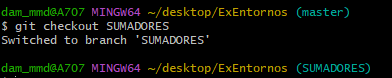

# Examen Entornos de Desarrollo 
## Tema 3: Git. 05/12/23


Nombre y apellidos: Daniel Martínez Martínez 			Fecha: 05/12/2023 

 

LINK DEL REPOSITORIO: https://github.com/DanielMartinezMartinez/DMMExamen23ED.git

> Vamos a crear una primera versión de una calculadora.  
> Debajo de cada ejercicio deberá aparecer capturas de pantalla pertinentes que justifiquen su realización. Intentad hacer todo lo posible desde la consola si no se indica lo contrario. 
> Se valorará negativamente las malas prácticass de GIT 

 

**1.- (0,75) Crea un repositorio en github “AAAExamen23ED“ e invítame a colaborar: "TomBort8" . AAA serán las primeras letras de tu nombre, 1er apellido y 2º apellido respectivamente.** 

En la captura inferior vemos como se crea un repositorio en GitHub

En la captura inferior vemos el directorio creado en GitHub

_directoriocreado.png)

En la captura inferior vemos como se añade a Tomas como colaborador del repositorio.


_invitarColaborador.png)


**2.- (0,75) Inicializa el repostiorio en local y vincúlalo al repostiroio de github** 


**3.- Crea un main que pida 2 números por teclado.** 

```
import java.util.Scanner; 

 

public class MostrarNumeros { 

 

    public static void main(String[] args) { 

        Scanner scanner = new Scanner(System.in); 

 

        System.out.println("Por favor, ingresa el primer número:"); 

        double numero1 = scanner.nextDouble(); 

 

        System.out.println("Ahora, ingresa el segundo número:"); 

        double numero2 = scanner.nextDouble(); 

 

        System.out.println("Los números ingresados son:"); 

        System.out.println("Número 1: " + numero1); 

        System.out.println("Número 2: " + numero2); 

 

        scanner.close(); 

    } 

} 
```

En la captura inferior se muestra el main creado


> Sube los cambios al repositorio. 

En la captura inferior vemos como se suben todos los cambios realizados al repositorio.


**4.- (0,2) Crea  un fichero ExplicaCalculadora.txt : “Este programa es una calculadora que va a poder realizar las operaciones básicas: sumar, restar, multiplicar y dividir”.** 

En las dos capturas inferiores se muestra como se crea el archivo y el contenido que contiene.


_ContenidoArchivo.png)


*  **4.1  (0,3)Crea también un fichero de texto que no debes subir a github pero debe estar dentro de la carpeta NoSubir.txt: (Este archivo debes añadirlo y quitarlo, como si te hubieras confundido). “Este archivo debe estar en la carpeta pero no subido a git”.** 

En la captura inferior se muestra como se crea el archivo: 


En la captura inferior se muestran como se añade se deshace y se muestra el estado de la subida del archivo

_SubirDeshacer.png)


> Muestra por comandos que no lo has subido 

> Sube los cambios al repositorio. 

En la captura inferior se muestra como se suben los cambios anteriores


_SubirCambios.png)


**5.- (0,5) Muestra la diferencia entre los 2 últimos commits.** 

En la captura inferior se muestra el comando para ver la diferencia entre los dos ultimos commits


Aparece un error y no consigo que se muestren

**6.- (0,5) Crea 2 ramas SUMADORES y RESTADORES** 

En la captura inferior se muestra como se crean ambas ramas


**7.- Sitúate en SUMADORES y añade al main lo siguiente:**

En la siguiente captura se muestar como nos situamos en la rama SUMADORES





```
public static double sumar(double a, double b) { 

        return a + b; 

    } 
public static double multiplicar(double a, double b) { 

        return a * b; 

    } 

public static double potencia(double base, double exponente) { 

        return Math.pow(base, exponente); 

    }  
```

> Sube los cambios al repositorio.

**8.- Sitúate en RESTADORES y añade al main lo siguiente:**

En la siguiente captura se muestar como nos situamos en la rama SUMADORES


```
public static double restar(double a, double b) { 

        return a - b; 

    } 

public static double dividir(double a, double b) { 

        if (b != 0) { 

            return a / b; 

        } else { 

            throw new IllegalArgumentException("No se puede dividir por cero"); 

        } 

    } 

public static double raizCuadrada(double a) { 

        if (a >= 0) { 

            return Math.sqrt(a); 

        } else { 

            throw new IllegalArgumentException("No se puede calcular la raíz cuadrada de un número negativo"); 

        } 

    } 
```

> Sube los cambios al repositorio. 

**9.- (1) Muestra la diferencia entre las ramas sumadores y restadores y guárdalo en un fichero llamado DIFERENCIA _RAMAS (desde consola). Este ficehro debe subirse al repositorio.** 

En la captura inferior vemos el comando para comprobar la diferencia entre las ramas pero como no hemos podido realizar los cambios no aparecen diferencias


**10.- (1,5) Fusiónalo en main (consola) y resuelve el conflicto (en gitHUB).** 

En la captura inferior se muestra el comando de fusion en el main y al no poder realizar cambios en las ramas la segunda parte del ejercicio no la puedo realizar adjunto la captura de la primer parte


> Sube los cambios al repositorio. 

 

**11.-(0,5) Borra las ramas SUMADORES Y RESTADORES.**

En la captura inferior se muestra como se eliminan ambas ramas
 


**12.- (0,5) entra a SOURCETREE y haz una captura del eje temporal del repositorio. Haz una breve explicación de lo que observas.** 

 En la captura podemos inferior podemos observar mediante el sourcetree las diferentes acciones que he ido realizando durante el examen.


**13.- (1) ¿ Cuál es la diferencia entre “git pull” y “git clone” ?** 
> git clone: Descarga un proyecto y toda su historia de versión </BR>
  git pull: Descarga el historial del marcador e incorpora cambios

**14.- (1) Abre el main y déjalo inservible. Sube los cambios. Deshaz el último commit.**
 

**15.- (1) Vuelve al estado en el que estaba el proyecto al acabar el ejercicio 3 en local.**
 
 
 **16.-(0,5) Añade este documento al repoitorio, con todas las imágenes para que se pueda ver desde git.**


**17.- Por último, ejecutad el siguiente comando:** 

> *history > historial.txt* 

**sube el resultado a aules junto al PDF de este documento.** 